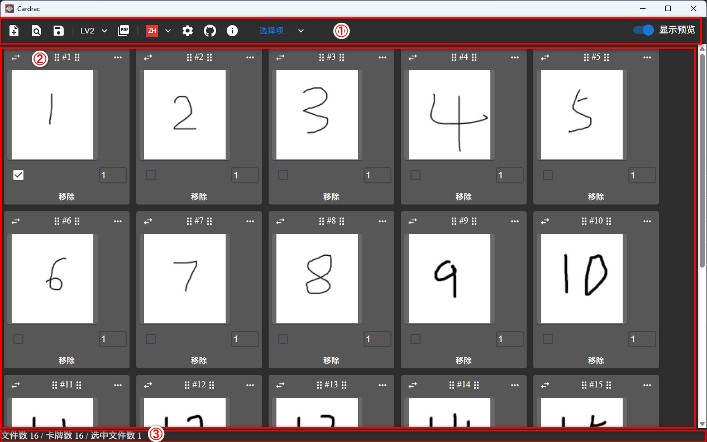
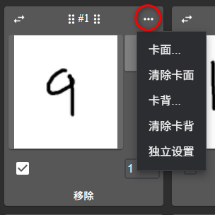
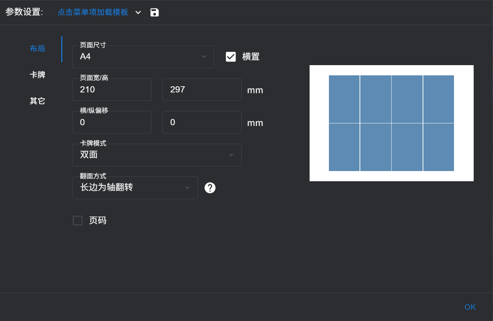
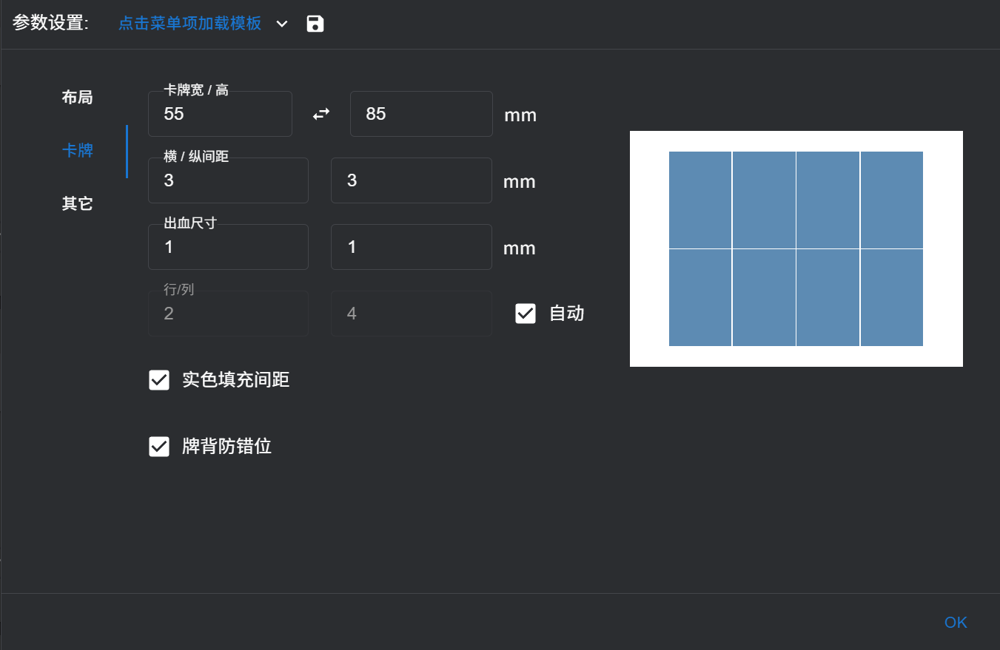
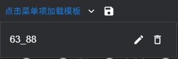
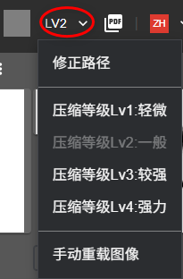
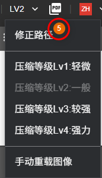
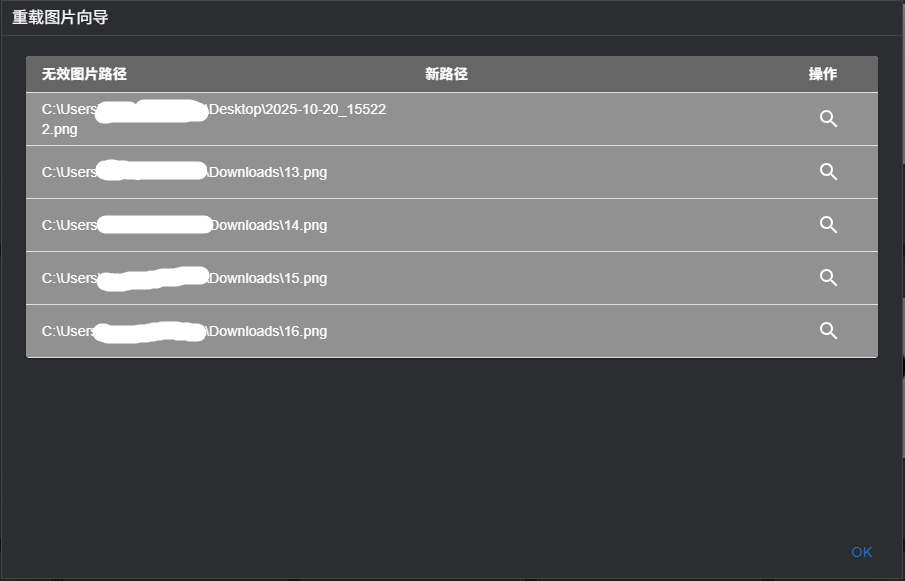
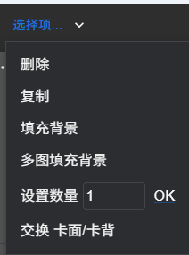
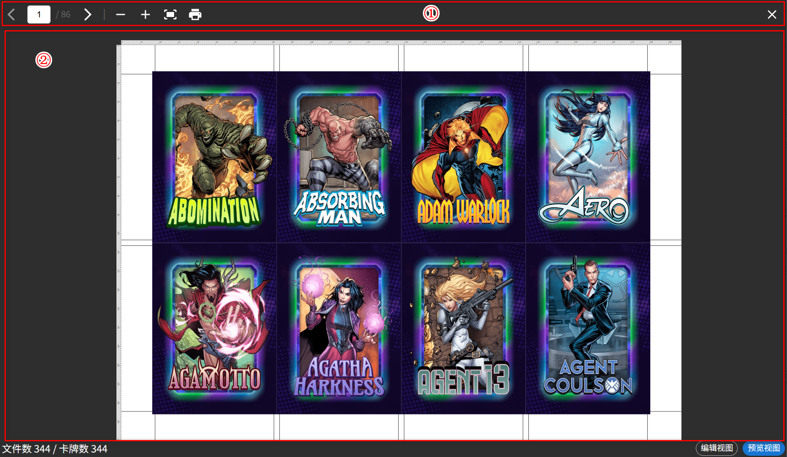

# CardraC 用户手册

------

## 1. 关于 CardraC

CardraC 是一款专业的卡片打印排版软件，帮助您高效地设计和打印各类卡片。

**主要功能：**
- 📄 支持单面、双面、对贴多种打印模式，另外还支持制作小册子的功能。
- 🖼️ 批量导入和管理卡片图片
- 📐 灵活的布局设置（行列、边距、出血）
- 🔄 智能的背面翻转处理
- 📤 一键导出 PDF 文件 与 PNG 文件
- ⚙️ 精细的单卡片配置

**适用场景：**
- 游戏卡牌制作（桌游、TCG）
- 名片批量打印
- 教学卡片制作
- 宣传卡片设计
- DIY 手工卡片
- 骑马钉小册子

> 💡 **提示：** CardraC 特别适合需要批量打印双面卡片的场景，能自动处理复杂的翻转逻辑。

[报告问题][github-issues-url] · [特性需求][github-issues-url]

[github-issues-url]: https://github.com/GeorgeChen-666/CardraC/issues/new

## 2 界面概览

CardraC 的主界面分为以下几个区域：

①工具栏与菜单栏。②文件列表。③状态栏

**1. 工具栏与菜单**

pnp文件：创建、打开、保存。

图像：全局背景图、设定压缩等级、导出pdf、导出png。

设置与其它：切换语言、项目设置、讨论组、github、关于

批量菜单：可以对选中的文件进行批量操作

显示预览：鼠标悬停图片可以查看其高清图

切换试图：双面卡牌时，背面预览图更大。

**2. 文件列表**

用于显示已经创建的文件列表

支持拖拽排序

右上角菜单进行文件编辑。

预览窗，当鼠标悬停到卡牌的图像上时，会有大尺寸预览窗显示，在窗体右上角有预览窗的开关。

**3. 状态栏**

当前文件数

最终导出的卡牌数（一个文件可以重复生成多个卡牌）

切换编辑视图、预览视图。预览视图模拟了导出后的文件内容。

## 3 第一个项目

**创建项目**

打开cardrac默认就是一个新项目，你也可以点击工具栏中的“创建pnp文件”，清空所有文件。

**添加文件**

文件列表中默认有一个添加按钮，点击加号图标可以通过选择一个或多个图片来导入文件到列表中。

也可以点击添加按钮底部的文字，添加一个空卡文件到列表中。这个空卡文件暂时未指定图片，仅仅是占位使用。

建议的图片格式：png和jpg

**设定背面**

第一次进入默认是双面打印，所以还需要设定卡牌背面。

可以点击工具栏中的全局背景，给全体卡牌设定一个默认的卡背。

单击卡牌文件右上角的三点图标会弹出文件操作菜单，选择卡背即可设定卡背图片。如果卡牌单独设定了卡背，则会忽略全集默认卡背。

**批量设置背面**

一张一张设定背面太麻烦？

你可以选中多个文件，在工具栏的批量菜单（选择项...）中点击“填充背景”，可以为选中的图片设定一个相同的卡背。

想设定不同的卡背？

你可以点击“多图填充背景”，选择多张图片设定卡背（**注意：多张图片的顺序是按照显示顺序排列，而不是点选顺序**）。

**导出pdf**

点击菜单栏的导出pdf按钮即可把创建的文件列表导出成pdf。

**导出png**

点击菜单栏的导出png按钮即可把创建的文件列表导出成png，如果是多个页面，则会以压缩包的形式导出。

## 4 项目设定

点击工具栏中的“参数设定”按钮，会弹出设定对话框。

### 4.1 布局

**页面尺寸**

预设了A5~A1的页面尺寸，默认为A4尺寸，并且支持自定义尺寸。也支持纸张横置排版。

**横/纵偏移**

卡牌默认全部都在页面的正中间展示，自动水平垂直居中。如果想调整可以通过这个参数设定所有卡牌在页面中的整体偏移量，这个偏移正面背面同步移动，不会导致正反错位。

**卡牌模式**

单面：

一般用作打印桌游插卡使用，仅打印纸张的一面，切割后结合牌套跟游戏王卡牌或者扑克插在一起游玩。

对贴：

对贴模式是指，卡面和卡背都在一面，打印完成后对折纸张，在空白面涂胶水再切割。这种制卡方式不挑打印机，使用比较薄的纸就可以制卡。另外正反对齐也不会过大。

对贴模式可以指定水平对折还是垂直对折两种对折方式。

双面：

双面打印就是最常规的打印方式，即打印完一面后翻转纸张，再次打印另一面。

双面打印的翻面方式比较有学问，分为长边为轴翻面和短边为轴翻面。不同的翻面防止决定了背面的排版方式，所以记得不要搞混了。

下图展示了翻面方式的不同。

蓝色表示横向进纸的打印机，一般比较大型的打印机采用这种进纸方式。

粉色表示纵向进纸的打印机，小型家用喷墨机一般采用这种进纸方式。

小册子模式：

小册子模式是帮助你生成可以打印骑马订小册子的模式。

如果你从第一页到最后一页排序再打印是再装订成小册子，顺序一定是不能用的。这个模式就是帮助你自动排序成骑马订小册子的顺序的打印文件。

小册子模式也是双面打印，所以也涉及翻面方式。

另有一个配置项就是是否在每页中重复，意思是，如果一页纸可以排得下多个小册子，你可以决定是打印完切割再自己组合成一个小册子或者一次打印多个小册子。

### 4.2 卡牌

**卡牌宽高**

设定最终卡牌的尺寸，也就是切割线标记的位置。如果是小册子模式就是设定小册子关闭状态下的尺寸。

**横纵间距**

卡牌的排版间距。

**出血尺寸**

出血的意思是，故意把图排的比切割位大一点，切掉一点图边，这样当正反对不齐的时候不会露出白边。出血的尺寸一般不会大于间距的一半。

**行列**

你可以指定让卡牌以几行几列展示。软件也会默认给你计算一个合理的行列。右侧预览区会大概展示出卡牌的排列方式。

**放缩**

给卡牌尺寸，间距，出血，指定一个缩放比例。

**实色填充间距**

这个功能是当你不想出血太多时，由于正反对不齐引起的露出白边会比较扎眼。系统会自动根据图案提供一个颜色接近的纯色来填充间距，这样即使露出空白边来也不会很明显。

**牌背防错位**

牌背防错位的意思就是仅正面应用间距，卡牌背面忽视间距，最大化的出血卡背图。

### 4.3 其它

**前切割线/后切割线**

常规：在四周空白区域以直线辅助线标定卡牌的切割位。

十字标：在卡牌的四角以十字标来标定卡牌的切割位。（不建议双面都显示十字标）

完整：同时添加常规标记和十字标。

**颜色 线粗**

设定切割线的颜色和线粗。

**背面打印修正**

有些打印机无法修正偏移量，所以我们可以在pdf里设定偏移量。这里是指将背面的图案位移多少，正面是不会改变的。

### 4.4 配置模板

当我们设定成型后，可以点击设定弹窗的保存按钮，给当前配置存成模板，并在下拉中灵活切换不同模板。

## 5 文件设定

### 5.1 图像压缩等级

如果你添加的图比较高清，这里会对图像进行一个快速的压缩。如果把高清图片直接加入到PDF中，导出时或者打开打印时很容易就卡死了。

系统中有4个预设压缩等级。

等级1：最大像素尺寸为15倍毫米数，精细度100%

等级2：最大像素尺寸为12倍毫米数，精细度90%

等级3：最大像素尺寸为9倍毫米数，精细度80%

等级4：最大像素尺寸为6倍毫米数，精细度70%

设置完压缩等级后，在添加图片时就会自动按照这个设定压缩图像。

但是已经添加过的图像不会立即生效，需要用户手动点击菜单中的重载图像才可生效，程序会按照设定好的压缩等级重新从图片文件中读取图像并压缩（如果图片文件有修改也可以通过此功能也可更新最新版的图像画面）。

添加到项目中的图像，程序会记录图片所在路径，但是如果添加后原始图像已经移动位置或者改名了，就没有办法重载图像了。这时候就需要使用修正路径功能。

菜单打开时，如果检测到有图像路径失效，则会在菜单中显示失效路径图片数，点击该菜单项后会弹出路径修正向导。

依次选中图像对应的新路径就可以更新项目文件中记录的路径。

### 5.2 单个文件设定

1.交换卡面卡背的图像
2.点击此处拖拽文件，如果选中了多个文件，则会将所选文件一并拖拽。
3.文件设定菜单
4.卡面图
5.卡背图
6.展示文件是否被选中
7.文件图重复数
8.删除此文件

**文件设定菜单**

这里可以单独设定或清除卡面图和卡背图，并给卡牌单独设定出血多少。

### 5.3 批量文件设定

也可以通过下面的菜单批量设定选中的文件。

## 6 预览视图

### 6.1 图像压缩等级

**1. 工具栏**

页面导航：页面导航的前进后退，选择预览具体哪个页面，鼠标悬停在文本框时滚动滚轮可以快速切换页面。

预览视图操作按钮：放大、缩小、适应窗口。

**2. 预览视图**

鼠标滚轮：预览界面的放大与缩小。

shift+鼠标滚轮：快速页面切换。

拖拽：改变预览位置。

双击：适应窗口。