# CardraC User Manual

---

## 1. About CardraC

CardraC is a professional card print layout software that helps you efficiently design and print various types of cards.

**Key Features:**
- 📄 Supports one-side, double-side, fold-in-half, and brochure printing modes
- 🖼️ Batch import and manage card images
- 📐 Flexible layout settings (rows/columns, margins, bleed)
- 🔄 Smart back-side flip handling
- 📤 One-click export to PDF and PNG
- ⚙️ Fine-grained per-card configuration
- 🖨️ Direct print with layout, supports offset and scale adjustment

**Use Cases:**
- Game card making (board games, TCG)
- Business card batch printing
- Educational flashcard production
- Promotional card design
- DIY handmade cards
- Saddle-stitch booklets

> 💡 **Tip:** CardraC is especially suitable for scenarios requiring batch double-sided card printing, with automatic handling of complex flip logic.

[Report an Issue][github-issues-url] · [Request a Feature][github-issues-url]

[github-issues-url]: https://github.com/GeorgeChen-666/CardraC/issues/new

## 2. Interface Overview

CardraC's main interface is divided into the following areas:

1 Toolbar & Menu Bar　2 File List　3 Status Bar

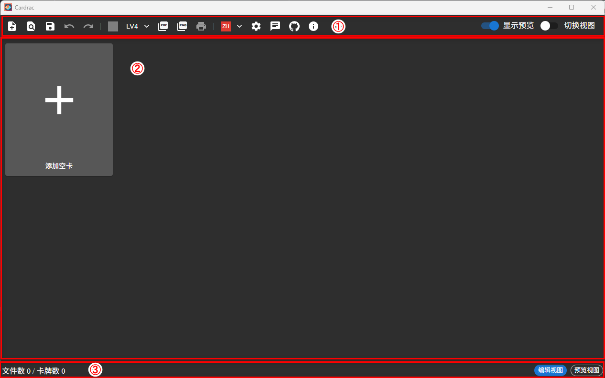

**1. Toolbar & Menu**

- **PNP File:** Create, open, and save PNP files.
- **Image:** Set global background, compression level, export PDF, export PNG.
- **Settings & Others:** Switch language, project settings, community group, GitHub, about.
- **Bulk Menu:** Perform batch operations on selected files.
- **Show Preview:** Hover over an image to view a high-resolution preview.
- **Switch View:** In double-sided mode, shows a larger back-side preview.

**2. File List**

- Displays the list of created card files.
- Supports drag-and-drop reordering.
- Click the menu icon in the top-right corner of a card for file editing options.
- A preview window appears when hovering over a card image. The toggle is located in the top-right corner of the window.

**3. Status Bar**

- Current file count.
- Total exported card count (a single file can generate multiple cards via repeat).
- Toggle between Edit View and Preview View. Preview View simulates the exported output.

## 3. Your First Project

**Create a Project**

CardraC opens with a new project by default. You can also click **"Create PNP File"** in the toolbar to clear all existing files and start fresh.

**Add Files**

The file list contains an add button by default. Click the **"+"** icon to import one or more images into the list.

You can also click the text below the add button to add an **empty card** — a placeholder without an assigned image.

Recommended image formats: **PNG** and **JPG**

**Set the Back Side**

The default mode is double-sided printing, so you also need to set the card back.

Click **"Global Default Back"** in the toolbar to assign a default back image for all cards.

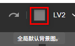

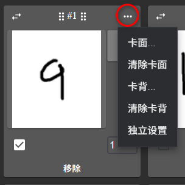

Click the **three-dot icon** in the top-right corner of a card to open the file menu, then select the back image. If a card has its own back image set individually, the global default back will be ignored for that card.

**Batch Set Back Side**

Setting backs one by one is tedious?

Select multiple files and click **"Fill Back"** in the bulk menu to assign the same back image to all selected cards.

Want different backs for each card? Click **"Fill Multi Back"** to select multiple images and assign them to selected cards one by one.

**Advanced: Add Files with Face & Back Together**

You can specify both face and back images at the same time in the add dialog.

Steps: After selecting face images, **do not click OK yet**. Click the **"Lock Face"** button to lock the selected face images, then select the back images. Once all selections are made, click **OK**.

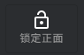

**Export PDF**

Click the **Export PDF** button in the menu bar to export the file list as a PDF.

**Export PNG**

Click the **Export PNG** button in the menu bar to export the file list as PNG images. If there are multiple pages, they will be exported as a **ZIP archive**.

## 4. Project Settings

Click the **"Settings"** button in the toolbar to open the settings dialog.

### 4.1 Layout

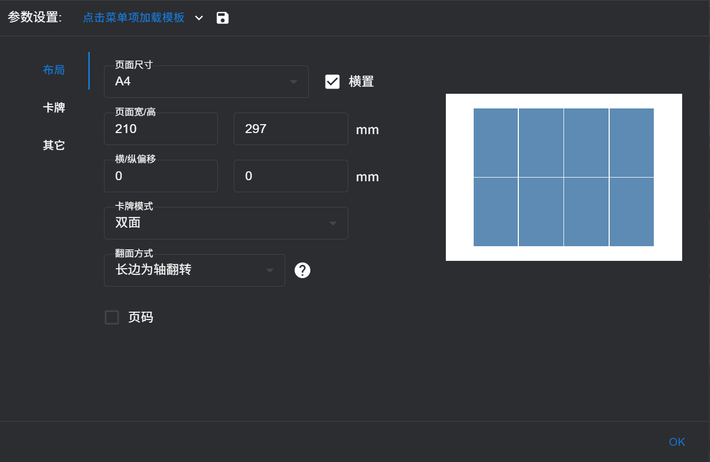

**Page Size**

Presets from A5 to A1 are available, with A4 as the default. Custom sizes are also supported, as well as landscape orientation.

**Offset X / Y**

Cards are centered on the page by default. Use these parameters to adjust the overall offset of all cards on the page. This offset applies to both front and back simultaneously, so it will not cause front-back misalignment.

**Card Mode**

- **One Side:** Prints only one side of the paper. Suitable for use with card sleeves alongside existing cards (e.g., board game or poker cards).

- **Fold In Half:** Both face and back are printed on the same side. After printing, fold the paper and apply glue on the blank side before cutting. This method works with most printers and thinner paper, and alignment error is relatively small.

- **Double Sides:** Standard duplex printing — print one side, flip the paper, then print the other side. The flip method matters: you can flip along the long edge or the short edge as the axis. Different flip directions determine how the back side is laid out, so make sure not to mix them up.
The diagram below illustrates the difference between flip methods.

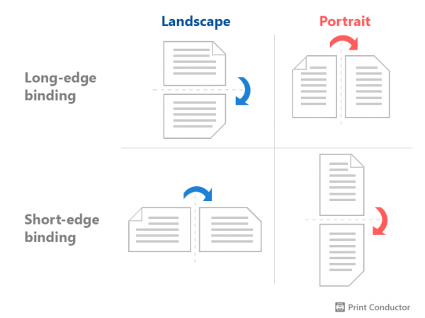

Blue represents printers that feed paper horizontally, typically larger professional printers. Pink represents printers that feed paper vertically, which is common for small home inkjet printers.

- **Brochure:** Brochure mode automatically reorders your pages into the correct sequence for printing a saddle-stitch booklet. If you simply print pages in order from first to last and then bind them, the page order will be wrong. This mode handles the reordering for you automatically. Since brochure mode is also duplex printing, the flip axis setting applies here as well. There is an additional option for repeating per page — if multiple booklets fit on a single sheet, you can choose whether to print them all at once or print one at a time and assemble them after cutting.

### 4.2 Card

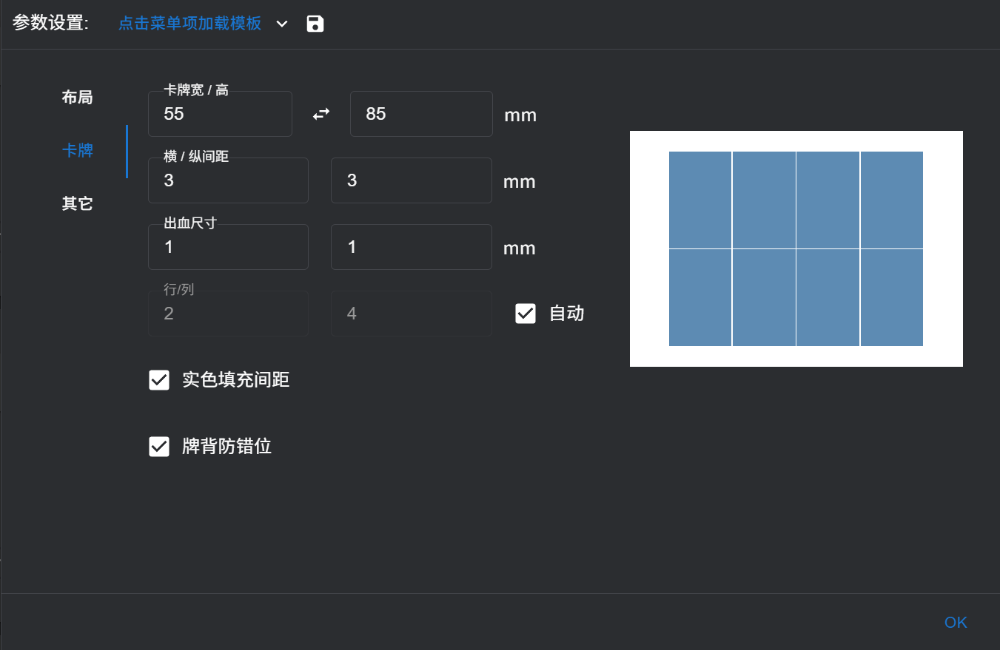

**Card Width / Height**

Sets the final card size, i.e., the position of the cut lines. In brochure mode, this refers to the closed booklet size.

**Margin X / Y**

The spacing between cards in the layout.

**Bleed Size**

Bleed means intentionally printing the image slightly larger than the cut line, so that minor misalignment does not expose a white border. Bleed size should generally not exceed half the margin.

**Rows / Columns**

Manually specify the number of rows and columns, or let the software calculate an optimal layout automatically. The right-side preview shows an approximate arrangement.

**Margin Color Filling**

When bleed is minimal, misalignment may expose white borders. This feature automatically samples a color close to the image edge and fills the margin with it, making any exposed gap less noticeable.

**Avoid Dislocation**

Applies margin only to the front side. The back side ignores the margin and maximizes bleed coverage.

### 4.3 Other

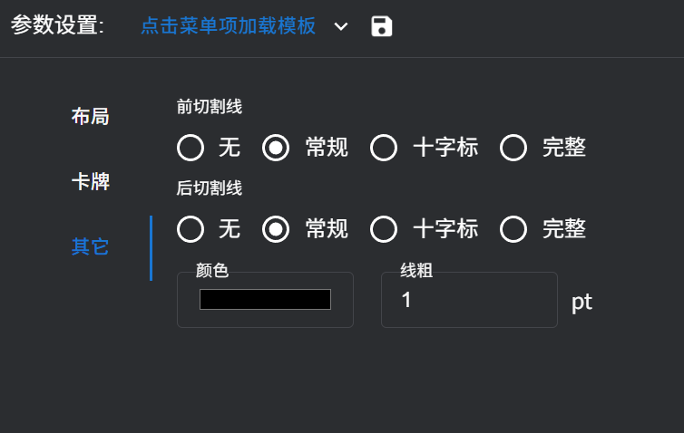

**Front / Back Cut Line**

- **Normal:** Straight guide lines in the blank area around the cards.
- **Cross:** Cross marks at the four corners of each card. (Not recommended to enable on both sides simultaneously.)
- **Complete:** Combines both normal lines and cross marks.

**Color / Line Weight**

Set the color and thickness of the cut lines.

### 4.4 Config Templates

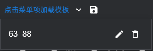

After completing your settings, click the **Save** button in the settings dialog to save the current configuration as a named template. Switch between templates anytime via the dropdown menu.

## 5. File Settings

### 5.1 Image Compression Level

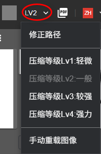

If your imported images are high resolution, CardraC will compress them automatically. Embedding uncompressed high-resolution images directly into a PDF can cause the application or printer to freeze.

There are 4 preset compression levels:

| Level | Max Pixel Size | Quality |
|-------|---------------|---------|
| 1 | 15× mm value | 100% |
| 2 | 12× mm value | 90% |
| 3 | 9× mm value | 80% |
| 4 | 6× mm value | 70% |

After setting the compression level, newly added images will be compressed automatically. **Already imported images will not be affected immediately** — click **"Manual Reload"** in the menu to re-read and compress them from the source files. This also picks up any changes made to the source images.

CardraC records the file path of each imported image. If the source file is moved or renamed after import, reloading will fail. In this case, use the **Fix Path** feature.

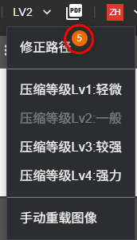

When the menu is opened, if any image paths are detected as invalid, the number of broken images will be shown in the menu. Click the menu item to open the **Path Fix Wizard** and reassign new paths one by one.

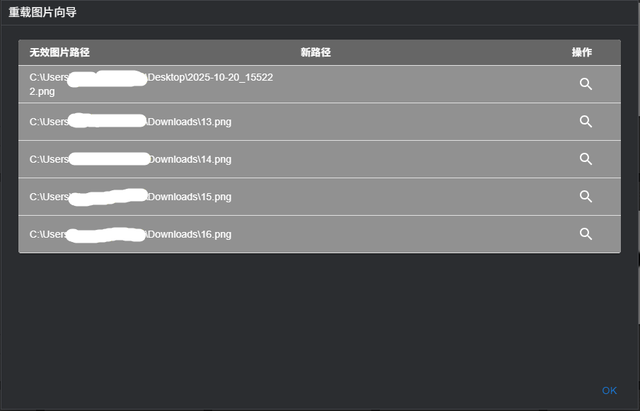

Select the new path for each image one by one to update the recorded paths in the project file.

### 5.2 Per-Card Settings

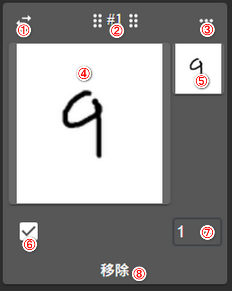

Each card has the following controls:

1. Swap face and back images
2. Drag handle — if multiple cards are selected, all selected cards are dragged together
3. File settings menu
4. Face image
5. Back image
6. Selection indicator
7. Repeat count
8. Delete this card

**File Settings Menu**

Allows individually setting or clearing the face and back images.

**Individual Config**

Lets you set a custom bleed size for a specific card independently. Note: the individual bleed value must not exceed half the card margin.

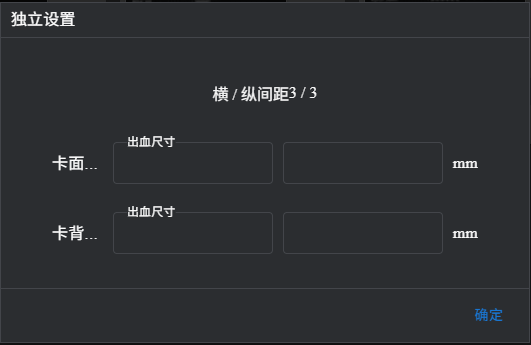

### 5.3 Bulk Card Settings

Select multiple cards and use the bulk menu in the toolbar:

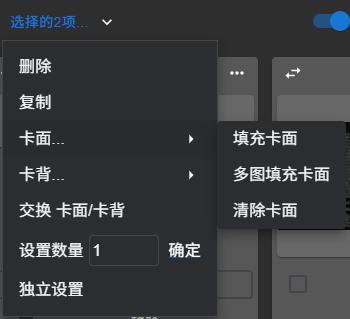

| Option | Description |
|--------|-------------|
| **Remove** | Delete selected cards |
| **Duplicate** | Clone selected cards and insert after them |
| **Face → Fill Face** | Set the same face image for all selected cards |
| **Face → Fill Multi Face** | Assign multiple images to selected cards in order |
| **Face → Clear Face** | Clear the face image of selected cards |
| **Back** | Same as above, for back images |
| **Swap Face/Back** | Swap face and back images of selected cards |
| **Set Count** | Set the repeat count for selected cards |
| **Individual Config** | Batch apply individual bleed settings to selected cards |

## 6. Printing

Click the **"Print"** button in the toolbar to open the print configuration panel on the right side.

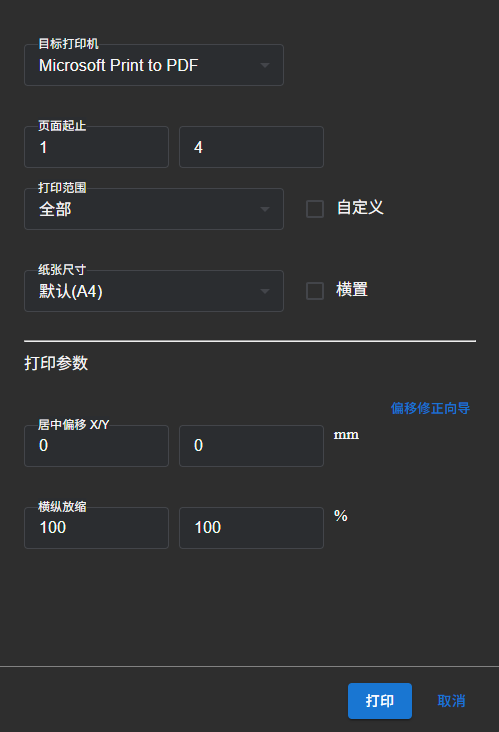

**Target Printer** Select the printer from the dropdown menu.

**Pages** Set the start and end page numbers for printing.

**Print Filter** Further filter the page range to print all pages, odd pages only, or even pages only.

**Custom Page Range** Specify exact pages to print using the format `1-5,8,11-13`. `-` indicates a continuous range, `,` separates individual pages or ranges.

**Paper Size** Select the physical paper loaded in the printer and its orientation (portrait/landscape).

**Center Offset X / Y** Adjusts the print offset to correct front-back alignment in duplex printing.

> Note: This differs from the **Offset X/Y** in project settings. Here, both front and back shift in the **same direction** (causing misalignment). In project settings, the back shifts in the **opposite direction** (keeping front and back in sync).

If you are unsure how to set the offset, use the **Adjust Offset Guide**.

**Scale X / Y** Overall page scaling in horizontal and vertical directions.

**Adjust Offset Guide** Click the **"Adjust Offset Guide"** button to open the wizard.

Prepare paper and print:
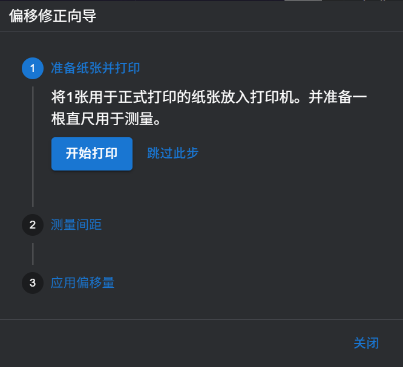

Take out the printed paper and measure the distances at four positions, then enter the values into the four input fields.

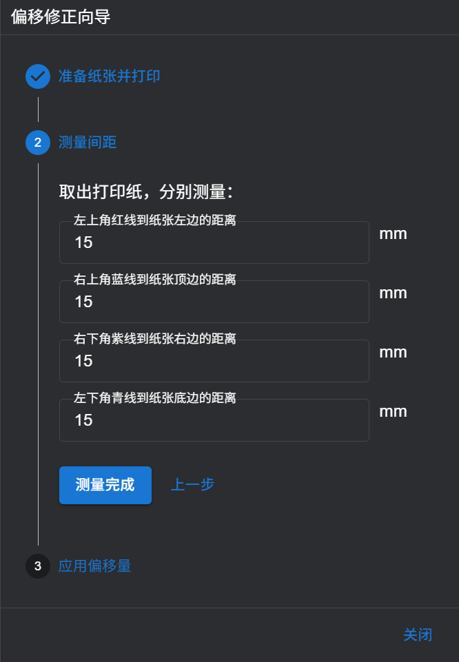

The system will automatically calculate the required offset based on the four measurements. Click the **Apply** button to accept the settings.
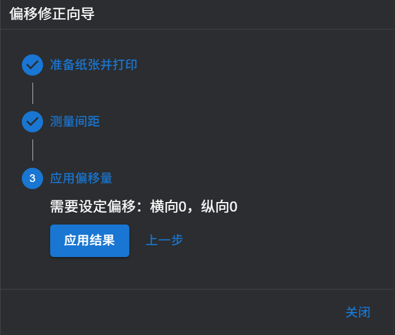

## 7. Preview View

### 7.1 Feature Overview

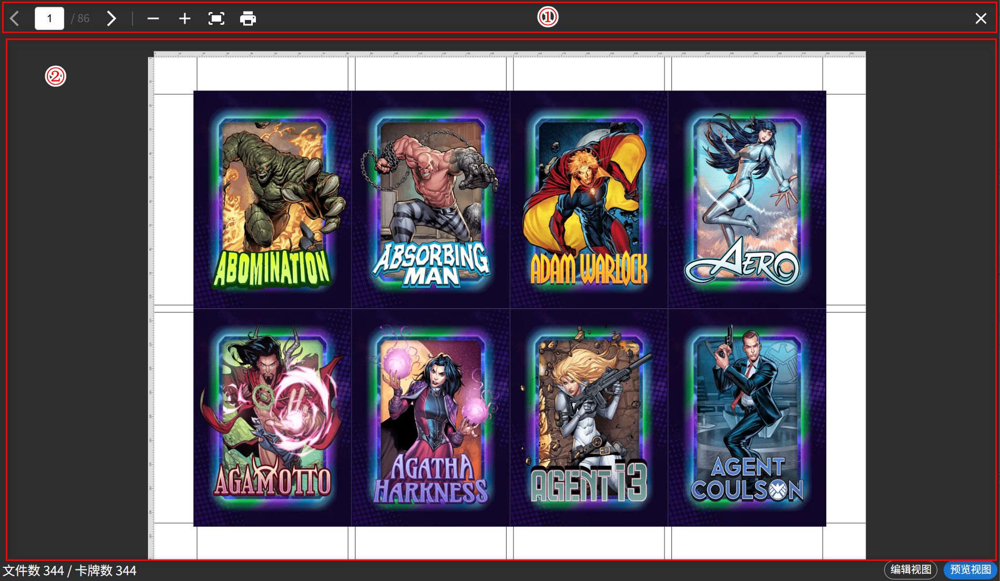

**1. Toolbar**

- **Page Navigation:** Navigate forward and backward between pages. Hover over the page number input and scroll the mouse wheel to quickly switch pages.
- **Preview Controls:** Zoom in, zoom out, fit to window.
- **Print:** Print directly from the preview using the current layout.

**2. Preview Area**

| Action | Result |
|--------|--------|
| Mouse wheel | Zoom in / out |
| Shift + mouse wheel | Quick page switch |
| Drag | Pan the preview |
| Double-click | Fit to window |

**3. Right-Click Context Menu**

You can edit card images directly in the preview view. When hovering over a face or back image, the corresponding image will display a blinking border. Right-click to open the context menu.

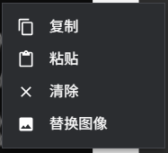

| Option | Description |
|--------|-------------|
| **Copy** | Copy the card image data to clipboard. Disabled if the image is empty. Note: a card may appear to have a back image due to the global background, but if no individual back is set, Copy will still be disabled. |
| **Paste** | Paste clipboard image data to the selected position. |
| **Clear** | Clear the card image at the selected position. Disabled if the image is empty (same note as Copy applies). |
| **Replace** | Select a new image file to replace the current card image. |

---

## 8. Multilingual Support

The application supports custom language configurations. Configuration files are located at [App Path]\resources\locales.

You can copy and rename en.json to add a new language configuration.

Icon folders follow the naming convention below — note that language abbreviations are used here, not country codes: https://github.com/AnandChowdhary/language-icons

Supported configuration filenames are listed here: https://app.unpkg.com/language-icons@0.3.0/files/icons

If en.json or zh.json becomes corrupted, exit CardraC, delete the damaged file(s), and restart. CardraC will automatically regenerate them.

---

## Contributing & Feedback

Found a bug or have a feature request? Feel free to open an issue on GitHub:

👉 [Submit an Issue or Feature Request](https://github.com/GeorgeChen-666/CardraC/issues/new)

---

## License

CardraC is an open-source project. Please refer to the repository for license details.

---

*Thank you for using CardraC! We hope it makes your card printing experience smoother and more enjoyable.* 🎴
